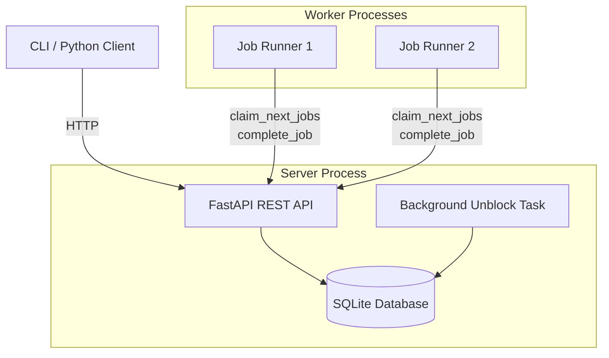
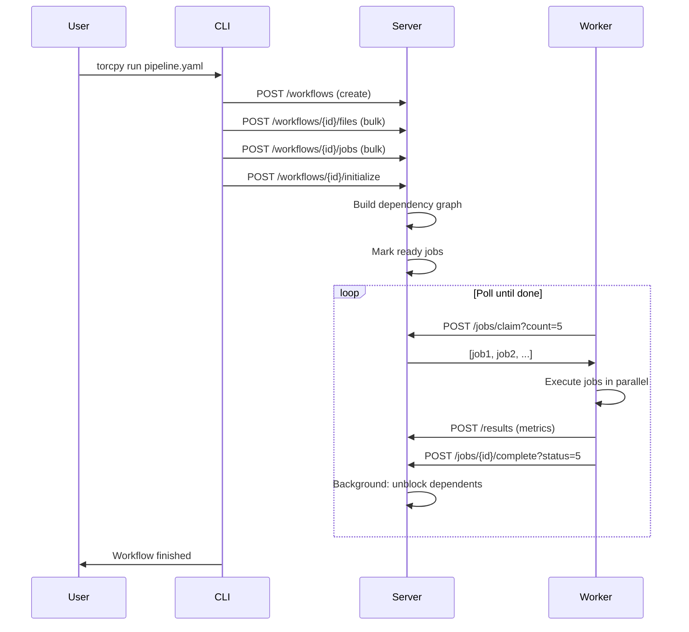
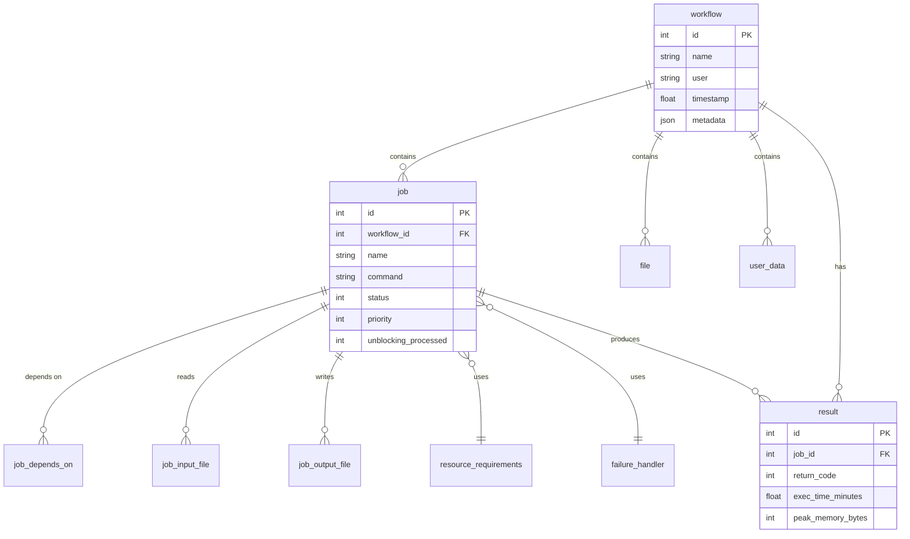

# Architecture Overview

TorcPy uses a **client-server architecture** where a lightweight REST API server manages all
workflow state, and one or more worker processes claim and execute jobs.

## Components

### Server

The server is a **FastAPI** application backed by a **SQLite** database. It exposes a REST API
for all workflow, job, file, and resource management operations.

Key design decisions:

- **WAL mode** — SQLite runs in Write-Ahead Logging mode for concurrent reads.
- **`BEGIN IMMEDIATE`** — Job claiming uses an immediate write lock, preventing two workers from
  claiming the same job.
- **Foreign key cascades** — Deleting a workflow automatically removes all associated jobs,
  files, results, etc.
- **Background unblock task** — A background `asyncio.Task` processes completed jobs and
  transitions blocked dependents to `ready`. This is deliberately not done inline for
  performance.

### Workers

Workers are Python processes that run `torcpy workflows run <id>`. Each worker:

1. Polls the server for `ready` jobs
2. Checks local resource availability (CPU, memory, GPU)
3. Claims a batch of jobs via `POST /workflows/{id}/jobs/claim`
4. Executes each job as an `asyncio.subprocess`
5. Reports results via `POST /workflows/{id}/results`
6. Completes the job via `POST /workflows/{id}/jobs/{job_id}/complete`

### CLI / Python Client

The `torcpy` command and `TorcClient` Python class are thin HTTP wrappers over the server API.
They share the same `httpx`-based async client.

## Data Flow

## Database Schema (Simplified)

## Next Steps

- [Job States](./job-states.md) — The full job lifecycle
- [Dependency Resolution](./dependencies.md) — How dependencies are built and resolved
