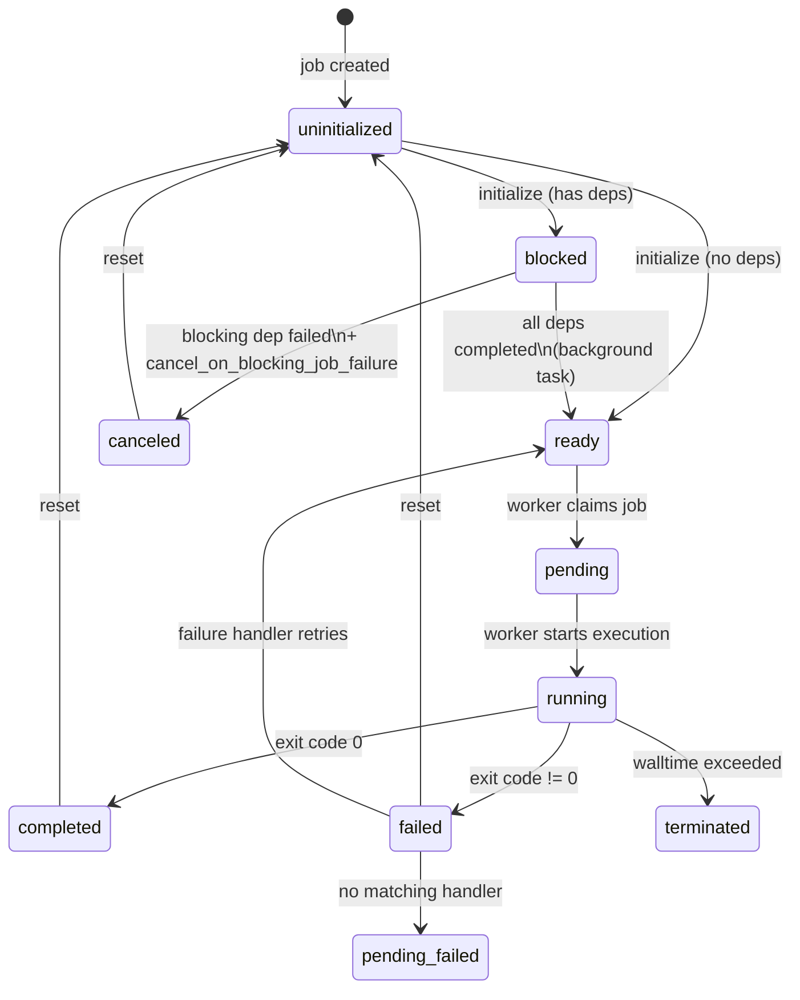

# Job States

Every job in TorcPy has a **status** stored as an integer in the database. Understanding these
states is essential for debugging and monitoring workflows.

## State Reference

| Value | Name | Description |
|:---:|---|---|
| `0` | `uninitialized` | Newly created, not yet part of the dependency graph |
| `1` | `blocked` | Waiting for one or more dependencies to complete |
| `2` | `ready` | All dependencies satisfied, available to be claimed |
| `3` | `pending` | Claimed by a worker, queued for execution |
| `4` | `running` | Actively executing as a subprocess |
| `5` | `completed` | Finished with return code `0` |
| `6` | `failed` | Finished with non-zero return code |
| `7` | `canceled` | Canceled by user or due to a blocking job failure |
| `8` | `terminated` | Forcibly killed (e.g., walltime exceeded) |
| `9` | `disabled` | Excluded from this workflow run |
| `10` | `pending_failed` | Failure handler could not determine recovery action |

## State Transition Diagram



## Terminal States

Jobs in these states will not be retried unless explicitly reset:

- `completed` — Success
- `failed` — Execution failure
- `canceled` — Canceled
- `terminated` — Killed
- `disabled` — Excluded
- `pending_failed` — Unhandled failure

## The `unblocking_processed` Flag

When a job transitions to a terminal state (`completed`, `failed`, `canceled`, `terminated`),
TorcPy sets `unblocking_processed = 0`. The background task watches for this flag and:

1. For `completed` jobs: checks each blocked dependent — if all its dependencies are now
   complete, transitions it to `ready`.
2. For `failed`/`canceled`/`terminated` jobs: if a dependent has
   `cancel_on_blocking_job_failure = true`, it is transitioned to `canceled`.

After processing, `unblocking_processed` is set back to `1`.

!!! warning "Do not complete jobs via `update`"
    Always use the `POST /jobs/{id}/complete` endpoint (or `client.complete_job()`) to finish a
    job. This endpoint sets `unblocking_processed = 0` and signals the background task.
    Using `PATCH /jobs/{id}` to change status bypasses this mechanism.

## Filtering Jobs by Status

```console
# List only ready jobs
torcpy jobs list 1 --status 2

# List only failed jobs
torcpy jobs list 1 --status 6
```

In the Python client:

```python
from torcpy.models.enums import JobStatus

jobs = await client.list_jobs(workflow_id=1, status=JobStatus.FAILED)
```
