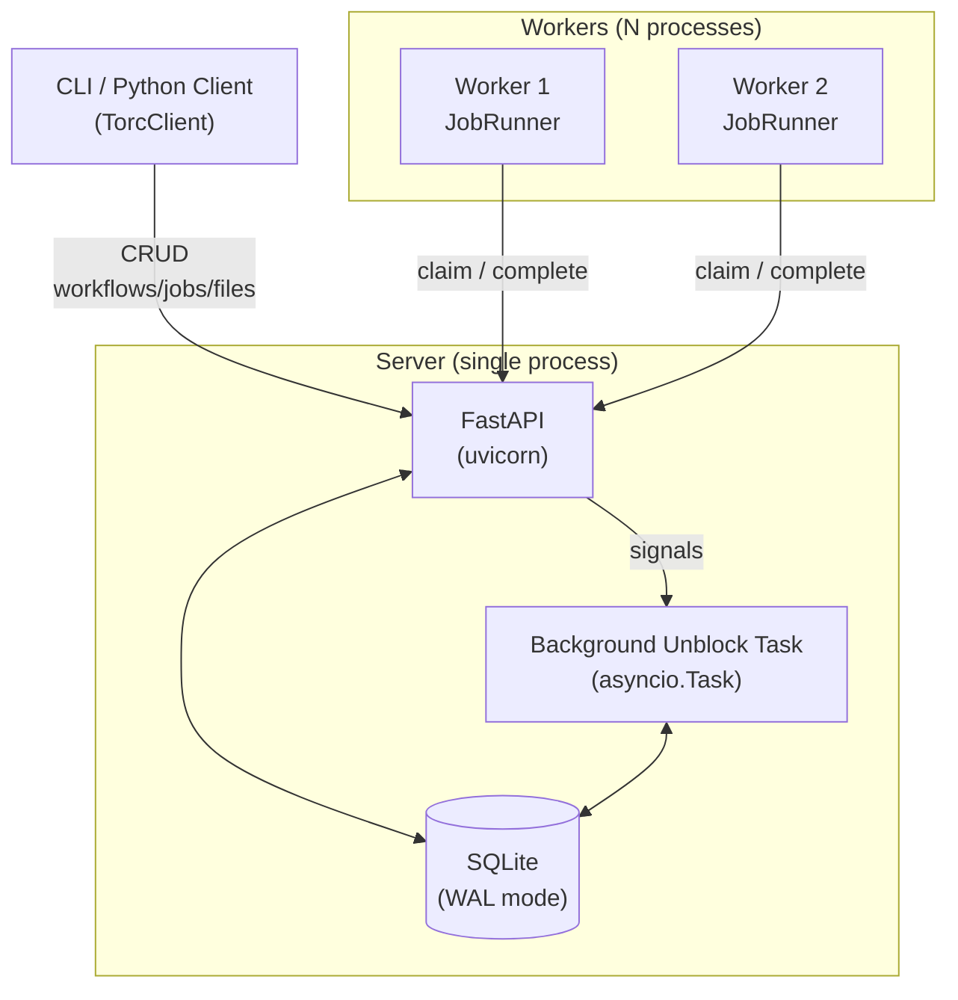

# Architecture

## System Overview

TorcPy follows a **client-server** architecture. A single server process manages persistent
state in SQLite. Multiple worker processes communicate with the server over HTTP.



## Key Design Principles

### Deferred Dependency Unblocking

Job completion is a hot path — many workers may complete jobs simultaneously. To keep
`complete_job` fast:

1. `complete_job` sets `unblocking_processed = 0` and immediately returns.
2. A background `asyncio.Task` runs every ~1 second, scanning for unprocessed completions.
3. The background task unblocks dependents in batch.

This means there is a ~1 second delay between job completion and dependents becoming ready.
For most workflows this is negligible; for very latency-sensitive pipelines, the interval
is configurable.

### Write-Locked Job Claiming

Multiple workers may simultaneously request jobs. To prevent double-allocation:

```sql
BEGIN IMMEDIATE;
SELECT id FROM job WHERE workflow_id=? AND status=2 ORDER BY priority DESC LIMIT ?;
UPDATE job SET status=3 WHERE id IN (...);
COMMIT;
```

`BEGIN IMMEDIATE` acquires a write lock before any reads, ensuring exclusivity.
Other workers block (up to the 5-second busy timeout) and then proceed with the remaining
ready jobs.

### Cascade Deletes

Every child table references `workflow` with `ON DELETE CASCADE`. Deleting a workflow
removes all jobs, files, results, events, compute nodes, and schedulers atomically.

### No External Dependencies

TorcPy has no runtime dependency on external services (no Redis, RabbitMQ, PostgreSQL).
The server and database run in a single process. This makes deployment trivial and testing
straightforward.

## Concurrency Model

- **Server**: Single `uvicorn` process, `asyncio` event loop, multiple coroutines.
- **Database**: Single connection with WAL mode. Writes are serialized; reads are concurrent.
- **Workers**: Separate OS processes, each with their own `asyncio` event loop.
- **Job execution**: Each worker runs jobs as `asyncio.subprocess` tasks, with `asyncio.gather`
  for parallelism within a single worker.
