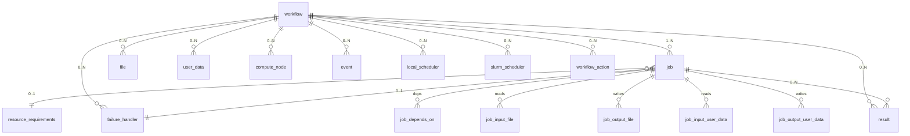

# Database Schema

TorcPy uses a single SQLite file. All tables are created at server startup via
`Database.init_schema()` using the `SCHEMA_SQL` constant in `server/database.py`.

## Schema (Simplified ERD)



## Core Tables

### `workflow`

| Column | Type | Notes |
|---|---|---|
| `id` | INTEGER PK | Auto-increment |
| `name` | TEXT | Workflow name |
| `user` | TEXT | Owner |
| `timestamp` | REAL | Unix timestamp of creation |
| `metadata` | TEXT | JSON blob |
| `slurm_defaults` | TEXT | JSON blob |
| `execution_config` | TEXT | JSON blob |
| `use_pending_failed` | INTEGER | Boolean |
| `project` | TEXT | Group label |

### `workflow_status`

| Column | Type | Notes |
|---|---|---|
| `workflow_id` | INTEGER PK/FK | References `workflow(id)` |
| `run_id` | INTEGER | Incremented on reset |
| `is_archived` | INTEGER | Boolean |
| `is_canceled` | INTEGER | Boolean |

### `job`

| Column | Type | Notes |
|---|---|---|
| `id` | INTEGER PK | |
| `workflow_id` | INTEGER FK | |
| `name` | TEXT | |
| `command` | TEXT | Shell command |
| `status` | INTEGER | 0–10, see [Job States](../concepts/job-states.md) |
| `resource_requirements_id` | INTEGER FK | Nullable |
| `scheduler_id` | INTEGER | Nullable |
| `failure_handler_id` | INTEGER FK | Nullable |
| `attempt_id` | INTEGER | Retry counter |
| `priority` | INTEGER | Higher = scheduled first |
| `unblocking_processed` | INTEGER | 0 = needs background processing |
| `cancel_on_blocking_job_failure` | INTEGER | Boolean |
| `supports_termination` | INTEGER | Boolean |

## Critical Indexes

| Index | Purpose |
|---|---|
| `idx_job_workflow_status` | Fast job listing by workflow + status |
| `idx_job_workflow_status_priority` | Claim ordering (priority DESC) |
| `idx_job_unblocking_pending` | Background task scan (partial index) |
| `idx_job_depends_on_depends_on_job_id` | Unblocking: find dependents of completed job |

### Partial Index for Background Task

```sql
CREATE INDEX idx_job_unblocking_pending
ON job(workflow_id, unblocking_processed)
WHERE status IN (5,6,7,8) AND unblocking_processed=0;
```

This index is tiny (only completed/failed jobs with pending unblock) and makes the background
task scan extremely fast even with millions of jobs.

## Migration Strategy

TorcPy uses raw `CREATE TABLE IF NOT EXISTS` for initial schema creation. For subsequent
migrations, use **Alembic** (`alembic/`).

!!! danger "SQLite CASCADE Safety"
    Never use the rename-recreate pattern (`CREATE new table, INSERT...SELECT, DROP old`)
    for tables that have `ON DELETE CASCADE` foreign keys. Inside a transaction,
    `PRAGMA foreign_keys=OFF` is silently ignored — `DROP TABLE` will cascade-delete child
    rows. Use `ALTER TABLE ADD COLUMN` instead.
