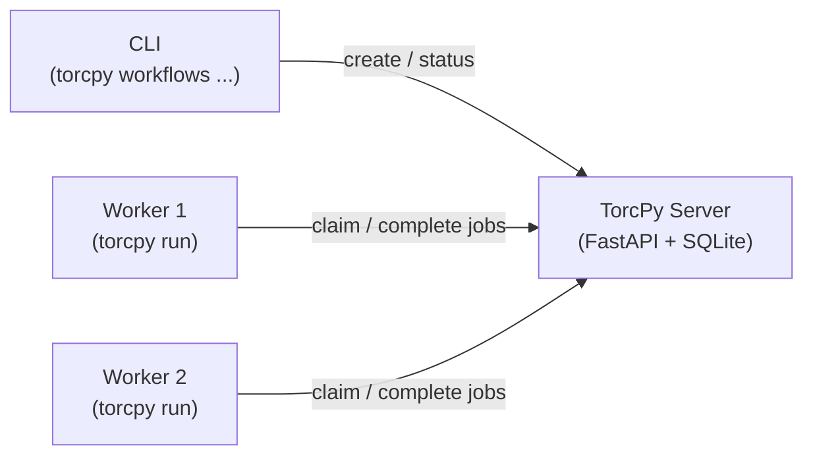

# Quick Start (Server + Workers)

This guide shows how to run TorcPy with a dedicated server process and one or more separate
worker processes. This is the typical production setup: the server manages state while workers
claim and execute jobs.

## Architecture



## Step 1: Start the Server

On the server host:

```console
torcpy server run --host 0.0.0.0 --port 8080 --db workflows.db
```

## Step 2: Create a Workflow

From any machine that can reach the server:

```console
export TORCPY_API_URL=http://server-host:8080/torcpy/v1

torcpy workflows create pipeline.yaml
# Created workflow 3
```

## Step 3: Start Workers

On each worker machine, run the job runner pointing at the workflow:

```console
export TORCPY_API_URL=http://server-host:8080/torcpy/v1

torcpy workflows run 3 --output-dir /scratch/job_logs
```

Workers automatically:

1. Initialize the workflow (build the dependency graph)
2. Poll the server for ready jobs
3. Claim jobs using a write-locked transaction (no double-allocation)
4. Execute jobs as subprocesses
5. Report results back to the server
6. Exit when all jobs are finished

## Step 4: Monitor Progress

```console
torcpy workflows status 3
torcpy jobs list 3
torcpy reports summary 3
```

## Multiple Workers

You can run multiple workers against the same workflow simultaneously. TorcPy uses
`BEGIN IMMEDIATE` transactions to ensure each job is claimed by exactly one worker:

```console
# Terminal 1
torcpy workflows run 3 --output-dir /scratch/worker1

# Terminal 2
torcpy workflows run 3 --output-dir /scratch/worker2
```

!!! warning "Initialize only once"
    If multiple workers start simultaneously, only one should call `initialize`.
    Using `torcpy workflows run` handles this safely — it initializes if needed,
    then polls for work. Multiple simultaneous `initialize` calls are idempotent.

## Environment Variable

Set `TORCPY_API_URL` to avoid passing `--url` on every command:

```console
export TORCPY_API_URL=http://server-host:8080/torcpy/v1
```

Or pass it inline:

```console
torcpy --url http://server-host:8080/torcpy/v1 workflows list
```

## Next Steps

- [CLI Cheat Sheet](../reference/cli-cheatsheet.md)
- [Concepts: Architecture](../concepts/architecture.md)
- [How-To: Track Workflow Status](../how-to/track-status.md)
