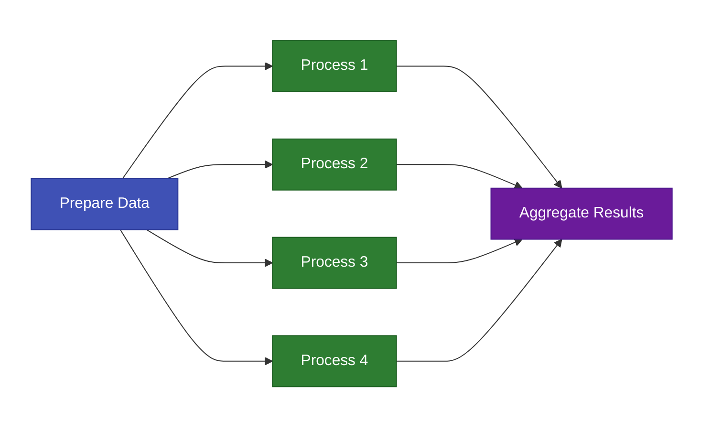

# TorcPy

**TorcPy** is a distributed workflow orchestration system for Python. It manages complex
computational pipelines with job dependencies, resource tracking, and parallel local execution —
all backed by a lightweight SQLite database and a clean REST API.



## Key Features

- **Declarative Workflow Definitions** — Define workflows in YAML or JSON. Dependencies are
  inferred automatically from file and data relationships.
- **Parameter Expansion** — Turn one job definition into hundreds with simple syntax:
  `"1:100"`, `"[0.001, 0.01, 0.1]"`, Cartesian product or zip.
- **Resource-Aware Scheduling** — Track CPU, memory, and GPU availability. Jobs only run when
  resources are available.
- **Deferred Dependency Unblocking** — Background task processes job completions and unblocks
  dependents for scalable pipelines.
- **REST API + Python Client** — Full HTTP API with a typed async Python client library.
- **Rich CLI** — Beautiful terminal output powered by `rich-click`.
- **Pure Python** — No Rust, no compiled extensions. Install with `uv` or `pip`.

## Who Should Use TorcPy?

- **Data Scientists** running parameter sweeps and model training pipelines
- **Computational Researchers** with multi-stage simulation workflows
- **ML Engineers** orchestrating preprocessing → training → evaluation pipelines
- **Anyone** who needs reliable, resumable job orchestration without HPC cluster complexity

## Documentation Structure

**Core** (for all users):

- **[Getting Started](./getting-started/index.md)** — Install and run your first workflow in
  minutes
- **[Concepts](./concepts/index.md)** — Architecture, job states, and dependency resolution
- **[Tutorials](./tutorials/index.md)** — Step-by-step workflow patterns
- **[How-To Guides](./how-to/index.md)** — Targeted solutions to specific tasks
- **[Monitoring](./monitoring/index.md)** — Reports, logs, and debugging
- **[Reference](./reference/index.md)** — CLI, spec format, API, environment variables

**Advanced**:

- **[Design](./design/index.md)** — Internal architecture for contributors

## Quick Example

```yaml title="pipeline.yaml"
name: ml-pipeline

files:
  - name: raw_data
    path: data/raw.csv
    st_mtime: 1710000000.0   # marks as pre-existing input
  - name: features
    path: data/features.csv
  - name: model
    path: models/model.pkl

jobs:
  - name: extract_features
    command: python extract.py --input data/raw.csv --output data/features.csv
    input_files: [raw_data]
    output_files: [features]

  - name: train_model
    command: python train.py --features data/features.csv --output models/model.pkl
    input_files: [features]
    output_files: [model]
    resource_requirements:
      num_cpus: 8
      memory: "16g"
      runtime: "PT2H"

  - name: evaluate
    command: python evaluate.py --model models/model.pkl
    depends_on: [train_model]
```

```console
$ torcpy server run --db pipeline.db &
$ torcpy run pipeline.yaml
Created workflow 1
Initialized: 1 ready, 2 blocked
Running job 1: extract_features
Running job 2: train_model
Running job 3: evaluate

Workflow 1 finished:
  Completed: 3
  Failed:    0
```

## Next Steps

- **New to TorcPy?** → [Quick Start (Local)](./getting-started/quick-start-local.md)
- **Understand the architecture** → [Architecture Overview](./concepts/architecture.md)
- **Create complex workflows** → [Tutorials](./tutorials/index.md)
- **Need a quick reference?** → [CLI Cheat Sheet](./reference/cli-cheatsheet.md)
