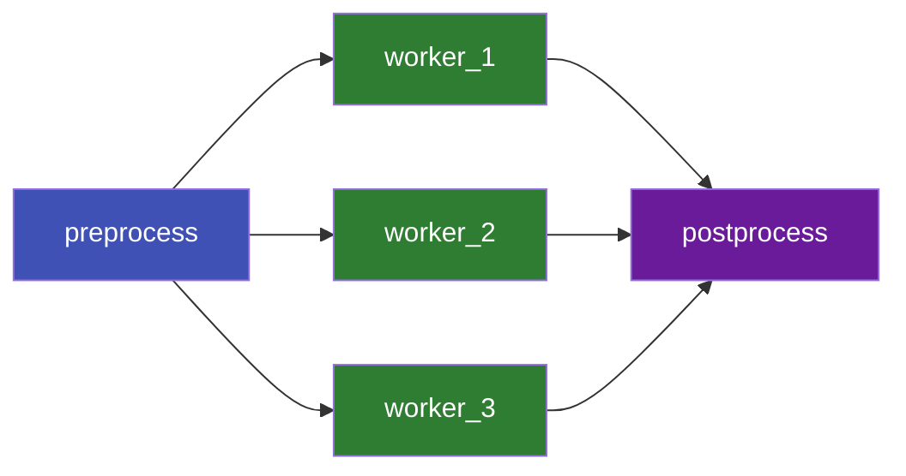

# Tutorial: Diamond Workflow

The **diamond pattern** is a fan-out/fan-in workflow: one job produces data, multiple jobs
consume it in parallel, then a final job aggregates the results.

This tutorial uses **implicit file dependencies** — you don't need to write `depends_on` at all.

## Goal



## Workflow Spec

```yaml title="diamond.yaml"
name: diamond-pipeline

files:
  - name: raw_input
    path: data/input.csv
    st_mtime: 1710000000.0   # pre-existing input

  - name: chunk_1
    path: data/chunk_1.csv
  - name: chunk_2
    path: data/chunk_2.csv
  - name: chunk_3
    path: data/chunk_3.csv

  - name: result_1
    path: results/result_1.json
  - name: result_2
    path: results/result_2.json
  - name: result_3
    path: results/result_3.json

  - name: final_report
    path: results/final_report.json

jobs:
  - name: preprocess
    command: python preprocess.py --input data/input.csv
    input_files: [raw_input]
    output_files: [chunk_1, chunk_2, chunk_3]

  - name: worker_1
    command: python worker.py --input data/chunk_1.csv --output results/result_1.json
    input_files: [chunk_1]      # implicit dep: depends on preprocess
    output_files: [result_1]
    resource_requirements:
      num_cpus: 4
      memory: "4g"

  - name: worker_2
    command: python worker.py --input data/chunk_2.csv --output results/result_2.json
    input_files: [chunk_2]      # implicit dep: depends on preprocess
    output_files: [result_2]
    resource_requirements:
      num_cpus: 4
      memory: "4g"

  - name: worker_3
    command: python worker.py --input data/chunk_3.csv --output results/result_3.json
    input_files: [chunk_3]      # implicit dep: depends on preprocess
    output_files: [result_3]
    resource_requirements:
      num_cpus: 4
      memory: "4g"

  - name: postprocess
    command: python postprocess.py --output results/final_report.json
    input_files: [result_1, result_2, result_3]   # waits for all 3 workers
    output_files: [final_report]
```

## How Implicit Dependencies Work

TorcPy builds the dependency graph during `initialize` by checking file relationships:

1. `preprocess` outputs `chunk_1`, `chunk_2`, `chunk_3`
2. `worker_1` inputs `chunk_1` → TorcPy inserts: `worker_1` depends on `preprocess`
3. Same for `worker_2` and `worker_3`
4. `postprocess` inputs `result_1`, `result_2`, `result_3` → TorcPy inserts 3 deps

You write **zero** `depends_on` declarations and get a fully correct dependency graph.

## Run It

```console
torcpy run diamond.yaml
```

```
Created workflow 1
Initialized: 1 ready, 4 blocked
Running job 1: preprocess
Running job 2: worker_1   # (all 3 start in parallel)
Running job 3: worker_2
Running job 4: worker_3
Running job 5: postprocess

Workflow 1 finished:
  Completed: 5
  Failed:    0
```

## Next Steps

- [Parameter Sweeps](./parameter-sweep.md) — Parameterize workers automatically
- [Multi-Stage Pipeline](./multi-stage.md) — Multiple fan-out/fan-in stages
