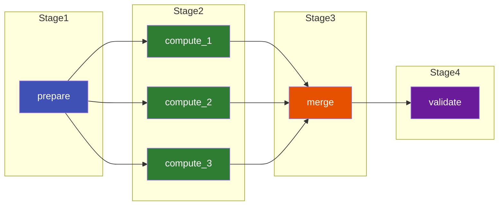

# Tutorial: Multi-Stage Pipeline

A **multi-stage pipeline** with barriers ensures all jobs in one stage finish before the next
stage begins. This is common in scientific workflows: preprocess → compute (parallel) →
postprocess → validate.

## Goal

Four stages with implicit synchronization:



## Workflow Spec

```yaml title="multi_stage.yaml"
name: multi-stage-pipeline

files:
  # Stage 1 outputs / Stage 2 inputs
  - name: chunk_{i}
    path: data/chunk_{i}.dat
    parameters:
      i: "1:3"

  # Stage 2 outputs / Stage 3 inputs
  - name: result_{i}
    path: results/result_{i}.json
    parameters:
      i: "1:3"

  # Stage 3 output / Stage 4 input
  - name: merged
    path: results/merged.json

  # Stage 4 output
  - name: report
    path: results/final_report.html

jobs:
  # ── Stage 1 ──────────────────────────────────────────────
  - name: prepare
    command: python prepare.py --chunks 3
    output_files: [chunk_1, chunk_2, chunk_3]

  # ── Stage 2 (parallel) ───────────────────────────────────
  - name: compute_{i}
    command: python compute.py --input data/chunk_{i}.dat --output results/result_{i}.json
    parameters:
      i: "1:3"
    input_files: [chunk_{i}]    # implicit dep on prepare
    output_files: [result_{i}]
    resource_requirements:
      num_cpus: 4
      memory: "8g"
      runtime: "PT1H"

  # ── Stage 3 (barrier) ────────────────────────────────────
  - name: merge
    command: python merge.py --input-dir results/ --output results/merged.json
    input_files: [result_1, result_2, result_3]   # waits for all 3
    output_files: [merged]

  # ── Stage 4 ──────────────────────────────────────────────
  - name: validate
    command: python validate.py --input results/merged.json --output results/final_report.html
    input_files: [merged]
    output_files: [report]
```

## Parameterized Stages

Scale to N chunks without changing the `merge` step:

```yaml title="multi_stage_n.yaml"
name: scalable-pipeline

files:
  - name: chunk_{i:03d}
    path: data/chunk_{i:03d}.dat
    parameters:
      i: "1:20"
  - name: result_{i:03d}
    path: results/result_{i:03d}.json
    parameters:
      i: "1:20"
  - name: merged
    path: results/merged.json

jobs:
  - name: prepare
    command: python prepare.py --chunks 20
    output_files:
      - chunk_001
      - chunk_002
      # ... list all 20, or use a script to generate
      - chunk_020

  - name: compute_{i:03d}
    command: python compute.py --input data/chunk_{i:03d}.dat
    parameters:
      i: "1:20"
    input_files: [chunk_{i:03d}]
    output_files: [result_{i:03d}]

  - name: merge
    command: python merge.py --input-dir results/
    depends_on_regexes:
      - "compute_.*"
    output_files: [merged]
```

!!! tip "Using `depends_on_regexes` for large fan-ins"
    When you have many parameterized jobs feeding into a single barrier, list them all
    in `depends_on_regexes` rather than explicitly naming each one.

## Run It

```console
torcpy run multi_stage.yaml
```

```
Created workflow 1
Initialized: 1 ready, 5 blocked

Stage 1:  Running job: prepare
Stage 2:  Running job: compute_1
          Running job: compute_2
          Running job: compute_3
Stage 3:  Running job: merge
Stage 4:  Running job: validate

Workflow 1 finished:
  Completed: 6
  Failed:    0
```

## Next Steps

- [Using User Data](./user-data.md) — Pass metrics between stages
- [How-To: Re-run Failed Jobs](../how-to/rerun-failed-jobs.md)
