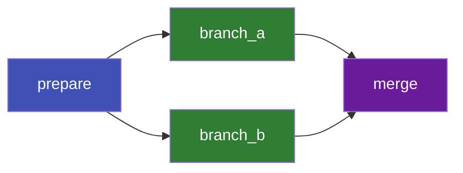

# Tutorial: Simple DAG

A **DAG** (Directed Acyclic Graph) is the most fundamental workflow pattern. Jobs run in
dependency order — nothing fancy, just reliable sequencing.

## Goal

Build a three-stage pipeline: A → B → C, where each stage depends on the previous.


## Workflow Spec

```yaml title="simple_dag.yaml"
name: simple-dag

jobs:
  - name: step_a
    command: echo "Step A: data preparation"

  - name: step_b
    command: echo "Step B: data processing"
    depends_on: [step_a]

  - name: step_c
    command: echo "Step C: report generation"
    depends_on: [step_b]
```

## Run It

```console
torcpy run simple_dag.yaml
```

Expected output:

```
Created workflow 1
Initialized: 1 ready, 2 blocked
Running job 1: step_a
Running job 2: step_b
Running job 3: step_c

Workflow 1 finished:
  Completed: 3
  Failed:    0
```

## What Happened

1. **Initialize** — TorcPy built the dependency graph:
    - `step_a` has no dependencies → `ready`
    - `step_b` depends on `step_a` → `blocked`
    - `step_c` depends on `step_b` → `blocked`
2. **Worker claims `step_a`** → transitions to `pending`, then `running`
3. **`step_a` completes** → background task unblocks `step_b` → `ready`
4. **Worker claims `step_b`** → runs, completes → background task unblocks `step_c`
5. **Worker claims `step_c`** → runs, completes
6. **All jobs done** → worker exits

## Variations

### Parallel branches

```yaml
jobs:
  - name: prepare
    command: echo prepare

  - name: branch_a
    command: echo branch_a
    depends_on: [prepare]

  - name: branch_b
    command: echo branch_b
    depends_on: [prepare]

  - name: merge
    command: echo merge
    depends_on: [branch_a, branch_b]
```



## Next Steps

- [Diamond Workflow](./diamond.md) — Implicit dependencies via files
- [Many Independent Jobs](./many-jobs.md) — Run hundreds in parallel
